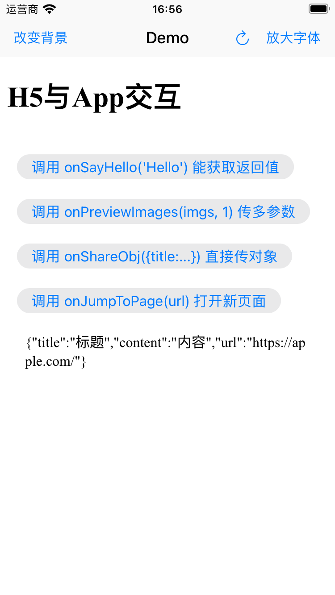

# CXYWebScript
简化 iOS App 与 H5 交互，H5 直接调用 window.App?.onSayHello('Hello')，即可完成对原生 App  `onSayHello:` 方法的调用。如此，与 H5 在 Android 端调用一致。

```js
// 以前 得区分环境
if (isAndroid) {
    window.App.onSayHello('Hello'); 
}
 
if (isiOS) {
    window.webkit.messageHandlers.onSayHello.postMessage('Hello');   
}

// 现在 iOS使用CXYWebScript后, H5无需引入任何库，iOS和Android统一调用：
window.App?.onSayHello('Hello')

PS1: 以上 window.App 是可以自定义的，如 window.CXY
PS2: 判断当前环境是客户端还是其他H5端，直接使用 if (window.App) 就行
```


### CXYWebScript 有以下特点：

- H5 在调用原生 App 方法是时，不需要区分是 Android 还是 iOS 环境
- 支持使用 block 和 target-action 方式注册 js 方法
- 支持原生 App 传递返回值给 H5 (限字符串类型或 nil )
- 支持 **iOS 10+**
- 不到 **200** 行代码




### 如何使用

#### H5 端 JS代码：

```js
// 调用原生App方法，并能接收App端方法的返回值
function onBtn1Click() {
    if (window.App) {
        // 接收 App 端的返回值
        const ret = window.App.onSayHello('Hello')
        console.log(ret) 
    }
}

// 传递多个参数给App端
function onBtn2Click() {
    const imgs = [
      'https://www.baidu.com/img/1.png', 
      'https://www.baidu.com/img/2.png', 
      'https://www.baidu.com/img/3.png']
    
    window.App?.onPreviewImages(imgs, 1)
}

// App 端调用此方法，修改body背景
function onChangeTheme(theme) {
    document.body.style.backgroundColor = theme
    return '修改成功' // 返回一个字符串给App端
}
```

#### App 端 OC代码，详细见[Demo](./CXYWebScript/CXYWebScript/ViewController.m)：

```objective-c
#import "CXYWebScript.h"

 - (void)setupWebScript {
   // 初始化 CXYWebScript
    self.webScript = [[CXYWebScript alloc] initWithWebView:self.webView];
    [self.webScript useUIDelegate];

    /* 添加与H5交互的方法 */
    // 使用 target-action 方式
    [self.webScript addTarget:self
                       jsFunc:@"onSayHello"
                        ocSel:@selector(onSayHello:)];
    
    // 使用 block 方式，
    // 如果 target-action 和 block 添加了相同的 jsFunc ，则只执行 block 方式的
    __weak typeof(self) weakSelf = self;
    [self.webScript addJsFunc:@"onSayHello" block:^NSString * _Nullable(NSArray *args) {
        NSLog(@"args: %@", args);
        NSLog(@"%@", weakSelf.webView.URL);
        return @"只支持返回字符串或nil，如何需要返回其他类型，可先将其转为JSON字符串再返回";
    }];
    
    // 多参数使用
    [self.webScript addTarget:self
                       jsFunc:@"onPreviewImages"
                        ocSel:@selector(onPreviewImages:currentIndex:)];
    
}

- (NSString*)onSayHello:(NSString*)param {
    NSLog(@"param: %@", param);
    return @"只支持返回字符串或nil，如何需要返回其他类型，可先将其转为JSON字符串再返回";
}

- (void)onPreviewImages:(NSArray*)images currentIndex:(NSString*)currentIndex {
    NSLog(@"images: %@", images);
    NSLog(@"content: %@", currentIndex);
}
  
// 修改body背景色
- (IBAction)onChangeBgColor:(id)sender {
    NSString *hexColor = [NSString stringWithFormat:@"#%06X", arc4random_uniform(0xFFFFFF)];
    NSString *js = [NSString stringWithFormat:@"onChangeTheme(\"%@\")",hexColor];
  
    // App 调用 H5 方法
    [self.webScript evaluateJavaScript:js completionHandler:^(id _Nullable result, NSError * _Nullable error) {
        NSLog(@"result: %@", result); //'修改成功'
    }];
}

```

### 原理:

1、让 WKWebView 注入下面的代码到 JS 环境中：

```js
window.App = new Proxy({},{
    get: function (target, name) {
        return function (...args) {
            return window.prompt(name,JSON.stringify(args)); 
        };
    } 
});

PS: 使用 window.webkit.messageHandlers[name].postMessage(args); 亦可，只是后续实现略有不同。
为什么选用window.prompt方式呢？ 因为它能直接同步返回值。
```

这样，当 js 调用时：

```js
window.App.onSayHello('Hello')  等价于 => window.prompt('onSayHello',['Hello']); 
```

2、而调用 `window.prompt` 会执行 WKWebView.UIDelegate 的方法：

```objective-c
- (void)webView:(WKWebView *)webView runJavaScriptTextInputPanelWithPrompt:(NSString *)prompt defaultText:(nullable NSString *)defaultText initiatedByFrame:(WKFrameInfo *)frame completionHandler:(void (^)(NSString * _Nullable result))completionHandler;

completionHandler('返回值') 调用后，能同步返回值给H5端。
```

其中的两个参数分别对应**方法名**和**参数列表JSON数组**：

```
(NSString *)prompt => 'onSayHello'
(nullable NSString *)defaultText => '[\'Hello\']'
```

3、对于 **target-action** 方式，根据方法名得到对应的 `SEL`，使用`NSInvocation`类，可以构造一个表示方法调用的对象，包括方法选择器、目标对象、参数和返回值。可以处理具有多个参数的方法调用

```objective-c
// self.scriptMap = {@"onSayHello": NSStringFromSelector(onSayHello:)}
NSString *selString = self.scriptMap[prompt];  
SEL sel = NSSelectorFromString(selString);
NSArray *args = [self arrayWithJSON:defaultText];

NSMethodSignature *signature = [self methodSignatureForSelector:aSelector];
NSInvocation *invocation = [NSInvocation invocationWithMethodSignature:signature];
[invocation setTarget:self];
[invocation setSelector:aSelector];
... 详细见源码
```

4、对于 **block** 方式，根据方法名找到对应的 block，直接执行 block 就行：

```objective-c
// self.blockMap = {@"onSayHello": CXYBlock}
CXYBlock block = self.blockMap[prompt];
NSArray *args = [self arrayWithJSON:defaultText];
block(args);
```

